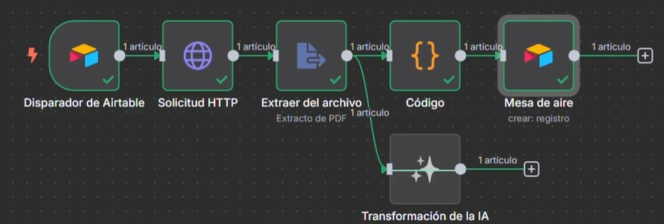

# Colektia Data Engineering Challenge: n8n Automation & SQL Analytics

## 📌 Project Overview
This repository contains my solutions for a two-part technical assessment for a Data/Analytics Engineering role. The project demonstrates a "full-stack" approach to data problems: from ingesting and parsing unstructured data using AI-powered automation to extracting complex business metrics from a relational database using advanced SQL.

> **🌐 Note on Language:** The documentation, video walkthrough, and underlying code are in Spanish, reflecting the original context of the assessment.

---

## 🚀 Part 1: AI-Powered Invoice Processing (n8n & Airtable)

### The Challenge
Design a fully automated workflow that triggers when a user uploads an invoice to Airtable, reads the file, extracts key data points (Invoice Number, Date, Total Amount, Vendor, Concept), and transcribes the structured data back into Airtable.

### The Solution & Technical Obstacles Overcome
Instead of relying on costly external APIs, I built a 100% autonomous and scalable pipeline using **n8n**. 
During development, I encountered limitations mapping dynamic expressions into Airtable. To solve this, I leveraged the **AI Transform** node to dynamically generate **JavaScript & Regex (Regular Expressions)**, injecting them into a Code node to accurately parse the plain text extracted from the PDFs. I also engineered data-type workarounds in Airtable to accept dynamic JSON outputs.

### 🏗️ Architecture Workflow


### 📺 Video Walkthrough
In this brief video, I explain the architecture, the technical bottlenecks encountered, and how the JavaScript/Regex solution was implemented:
**[-> Watch the Video Walkthrough (Spanish) Here](https://youtu.be/kg7SVxVOZCM)**

---

## 📊 Part 2: Sales Analytics (SQL)

### The Challenge
Analyze a simulated database of international sales to identify top-performing countries, calculate customer distribution, and rank sales executives based on performance metrics.

### Skills Highlighted
This analysis goes beyond basic aggregations, utilizing:
* **Window Functions:** Implemented `RANK() OVER (PARTITION BY...)` to dynamically rank the top-performing sellers within each specific country.
* **Subqueries & CTEs:** Used nested queries to pre-calculate total sales before applying ranking logic.
* **Aggregations & Joins:** Combined multiple relational tables (`sales`, `seller`, `country`) to compute averages (`AVG`) and totals (`SUM`).

### Example Query: Top Seller per Country
```sql
SELECT country, seller, total_sales
FROM (
    SELECT 
        c.name AS country, 
        se.name AS seller, 
        SUM(s.amount) AS total_sales,
        RANK() OVER (PARTITION BY c.name ORDER BY SUM(s.amount) DESC) AS seller_rank
    FROM sales s
    JOIN seller se ON s.seller_id = se.id
    JOIN country c ON s.country_id = c.id
    GROUP BY c.name, se.name
) ranked
WHERE seller_rank = 1
ORDER BY total_sales DESC;
